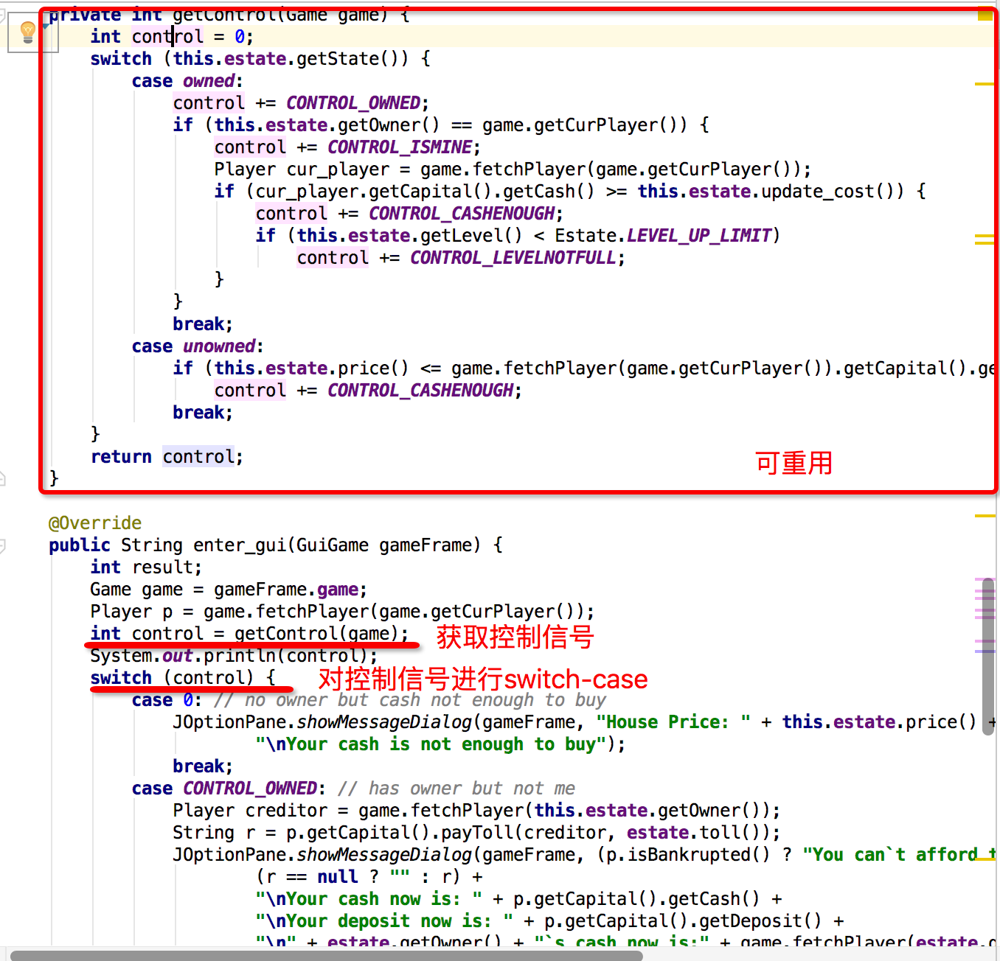
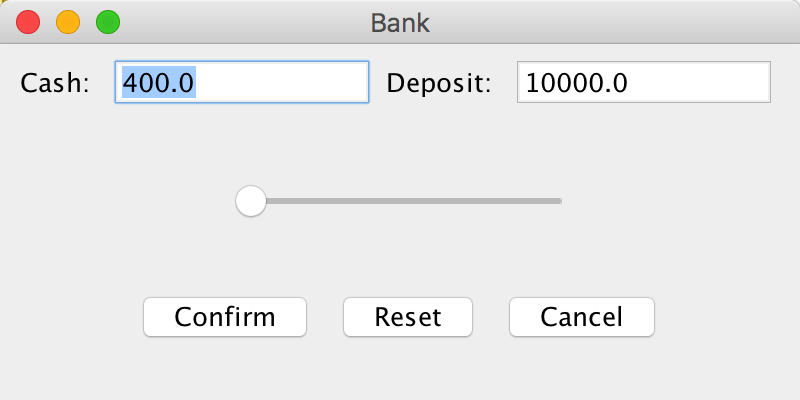
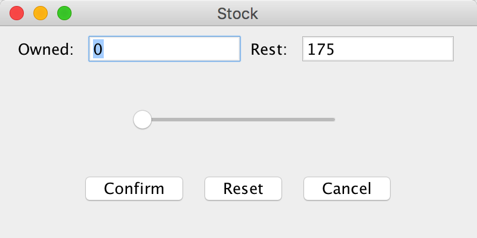

###Documentation
####Basic Idea
主要是基于pj1，对游戏逻辑部分予以保留，将输入输出部分改为对一些信号或者参数的设置，并通过调用gui_components包中的相应接口，实现界面功能的设计。由于在pj1中玩家交互部分和游戏引擎部份设计有所区分，所以在修改的绝大部分时间里，没有遇到太多重构的问题，但是有个别情况仍然需要重构之前的代码。
####Package Structure
#####pj1 packages: card_items, map_components, monopoly 
#####pj2 packages:  
1. card_items: 包含了道具卡类的包，所有道具卡继承自CardItem类，通过重载function_gui(Game game, Parameter parameter)函数实现道具功能。道具功能实现分为三部分：读参数，执行操作，输出结果。读参数的方法封装在Parameter接口中，每次创建一个新的道具类需要为这个道具类同时新建一个Parameter类，并实现getParameter()方法。执行操作由function_gui(Game game, Parameter parameter)负责。输出结果表示成function_gui()的返回值。这两个函数的调用由游戏引擎负责。 
2. drawChart: 包含了画折线图的两个类。ChartSeriesData用来表示折线图中的数据，TimeSeriesChart用来实现画折线图功能，并生成一个包含折线图的JPanel 
3. gui_components: 包含了所有GUI界面的类。 
    BankPanel: 银行业务界面
    DiceComponent: 主界面中骰子按钮
    GuiGame: 游戏主界面
    LotteryPanel: 彩票界面
    NewGameFrame: 新建游戏窗口
    NewGameInitializeData: 用来封装新建游戏得到的游戏参数信息
    PropshopPanel: 道具点界面
    PropUsePanel: 使用道具界面
    StockMarketPanel: 股票市场界面
    StockTransactionPanel: 进行单个股票交易的界面w
4. map_components: 包含地图上所有不同类型地点的类 
    所有地点类均即成自Spot，Spot继承自Thing并实现了Triggerable接口
5. monopoly: 包含了游戏逻辑的核心类

####Problems Encountered
1. 重构问题：pj1的代码有三处无法重用的地方，card_items包中的道具类、map_components包中的地点类、Menu类 
    1. card_items:
    重构思路：将道具功能分成三部分，读参数，执行操作，输出结果。其中执行操作部分可重用，读参数部分和输出结果部分分别交给Parameter类和GuiGame类完成
    2. map_components:
    重构思路：对于每个地点事件的逻辑进行分析，画出一张控制逻辑图。在响应地点事件前，getControl(Game game)函数根据当前上下文设置control变量记录控制逻辑的状态，最后将control变量传给执行操作的函数。这样，getControl(Game game)的代码就可以重用。例如，House类中：
    
    3. Menu类:
    在pj1中Menu类用来进行命令含交互，打印菜单并根据用户不同的输入，执行不同菜单选项。而在pj2中菜单的实现变成GUI的一部分，所以这个类的代码就几乎不能重用。对这个类采取的策略是，在实现新的MenuBar的过程中，参考Menu类的对游戏引擎的调用方式，对于可以重用的代码直接拷贝。
2. 界面设计问题：在界面设计的过程中，常常有些长得很相似但是略有差别的界面。比如pj2中，BankPanel界面和StockTransactionPanel两个界面 

更好的策略是设计一个界面原型，每当要生成这类界面的时候，可以直接继承界面原型，并对一些细节的地方进行修改，这样不仅开发更简单，而且易于维护和修改。
####To Be Improved