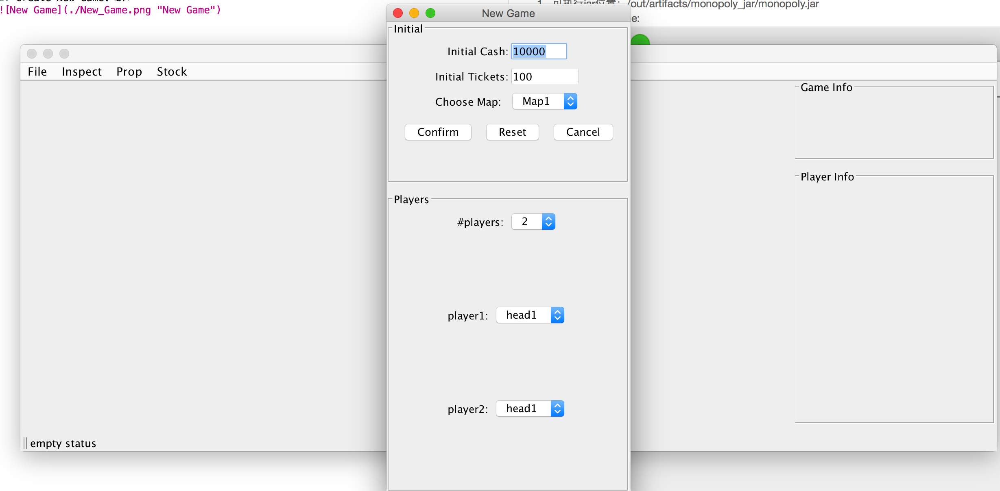
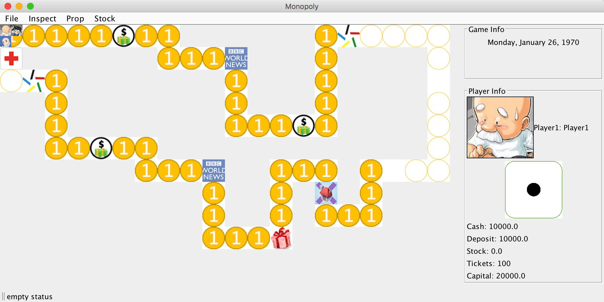
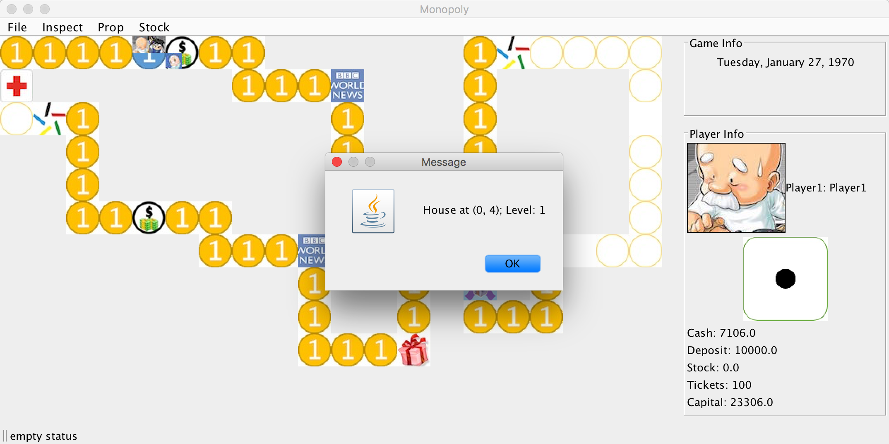
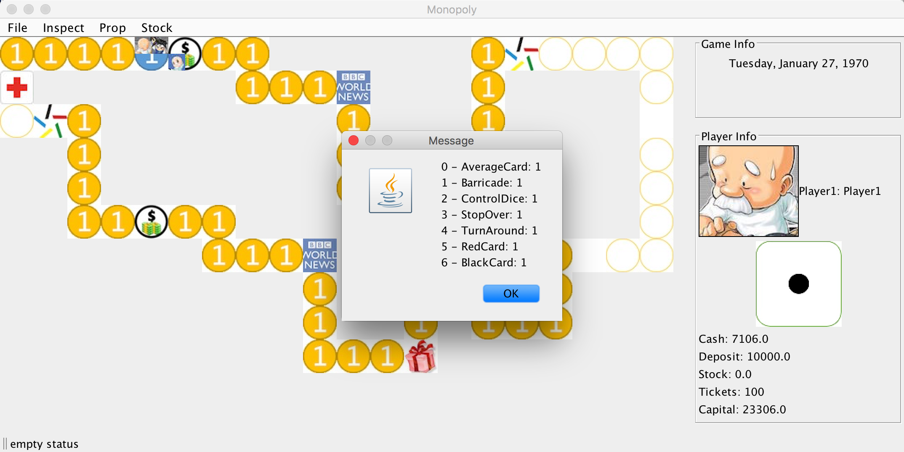
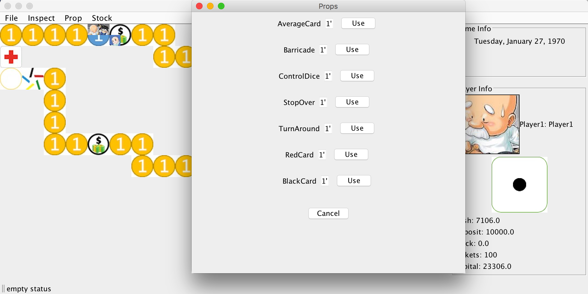
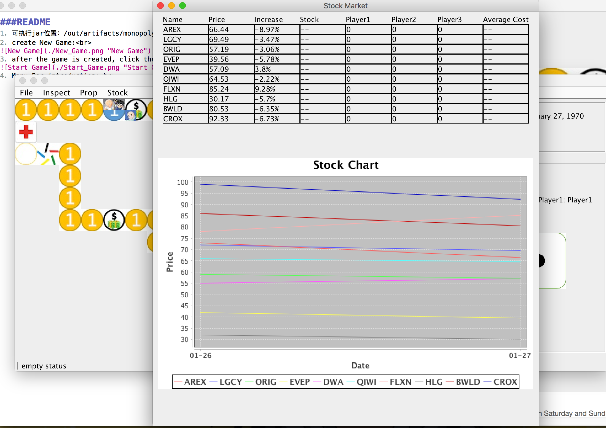
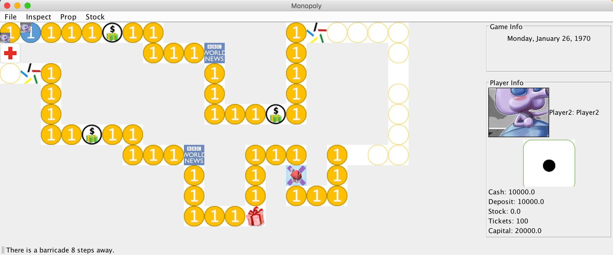

###README
1. 可执行jar位置：/out/artifacts/monopoly_jar/monopoly.jar
2. create New Game: 

3. after the game is created, click the dice to start your round 

4. Menu Bar introduction: 
	1. Inspect->House 
	inspect the House ownership information of the current player
	
	2. Prop->List 
	list all the prop you have
	
	3. Prop->Use 
	list all the prop you can use, and you can click the use button to use it
	
	4. Stock->Enter 
	enter stock market, this button is disabled on Saturday and Sunday
	
5. Status Bar 
the status bar shows whether it is safe ahead of the current player
